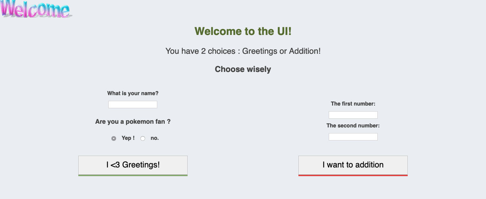
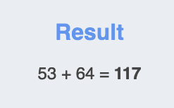

# SimpleCLI-webUI

Simple example of a python CLI with an available web interface - Created with flask and click

### Simple Installation

- Create a virtualenv : `virtualenv venv -p python3`
- Activate the virtualenv : `source venv/bin/activate`
- Install the dependencies: `pip3 install -r requirements`

u good to go

### Project

This POC was created to have an easy access to a skeleton of a command CLI written in Python with the framework *click* (cf. https://github.com/pallets/click) with a simple web-UI written with flask.

- 3 simple actions with CLI are avaible : addition / hello / web


Addition will do a simple addition of 2 number inputs of the user
    - example : `python3 app.py addition --nb1 1 --nb2 2`

```text
3
```

Hello will greet the user with the given username and if he's alive or not (idk why i did that???)
    - example : `python3 app.py hello --name sasha --not-alive`

```text
Hello sasha! I am glad you are alive!
```

The web UI is launchable with the web flag
    - example : `python3 app.py web`

```text
Launching web UI ...
 * Serving Flask app "web.flask" (lazy loading)
 * Environment: production
   WARNING: This is a development server. Do not use it in a production deployment.
   Use a production WSGI server instead.
 * Debug mode: on
 * Running on http://0.0.0.0:5000/ (Press CTRL+C to quit)
 * Restarting with stat
Launching web UI ...
```

- The web UI has error handling, user inputs, etc...

For this example, i did this UI :



Greeting example :


Addition example :


